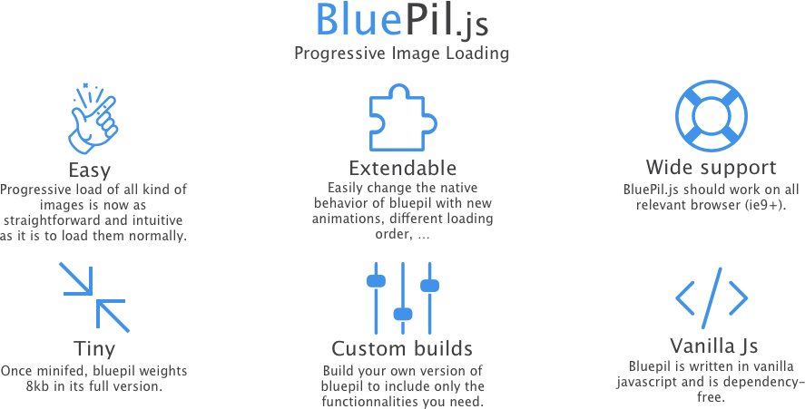

<p align="center">

</p>

<p align="center">

</p> 

[](https://travis-ci.org/tsucres/BluePil.js)

BluePil.js is a javascript library to progressively load images that works both for `img` tags **and** `background-images`.

\>>>>>>>> [DEMO](https://tsucres.github.io/BluePil.js/) <<<<<<<<

(**Warning for mobile users**: the demo contains large images, think about it if you're on mobile data :) )


# Usage

There are 2 basic use cases: 
1. background image: progressively load the `background-image` of an element
2. `img` tag: progressively load the image in the `src` of an `img` tag

## Install

1. According to the features you need, choose your distribution files from the dist folder (or build your own version, see the "Custom build" section bellow).


2. Add a link to the css in the head: 

```html
<link rel="stylesheet" href="bluepil.min.css">
```


3. And at the end of the body:

```html
<script src="bluepil.min.js"></script>
<script type="text/javascript">
    PIL.go();        
</script>
```


## Background image

To make the background image of an element load progressively, you just have to add the class `.progressive-bg-image` and specify the path to the background image and to the miniature.

It's also a good idea to add a `<noscript>` tag: 


```html
<div class="progressive-bg-image" data-full-image-path="<full image path> data-mini-image-path="<mini image path>">
    <noscript>"></noscript>
    
</div>
```

This will automatically work with any `background-position`.


However, currently, only the `background-size: cover` is supported.


## img tag

To make an `img` tag load progressively, you have to set 4 attributes: 

- `data-full-image-path`
- `data-miniature-path`
- `data-full-image-width`
- `data-full-image-height`

Again, you may want to add a `<noscript>` tag.

```html
" data-miniature-path="<mini image path>" data-full-image-height="<height of full image>" data-full-image-width="<width of full image>">
<noscript>" class="full-bg-image"></noscript>
```


**Note** that in every case a source to an image is needed, an image in a **base64** format is supported.


## In either cases

You can initialize and start loading all the images of the document with just one line of javascript. Put this code at the bottom of your body (just under import of `bluepil.min.js`):

```html
<script type="text/javascript">
PIL.go()
</script>
```


# Advanced usage

## Automatically generated markup

When you add the images to the document the way it's described in the previous section, bluepil automatically replaces them with the full markup it needs to display the miniature and the transition.


The full markup for a background image is the following: 

```html
<div class="progressive-bg-image">
    "> 
    ">
    <canvas class="full-absolute progressive-img-load-canvas"></canvas>

    <!-- Your content -->
</div>
```


The one for an img tag is: 

```html
<div class="aspectRatioPlaceholder">
    <div class="aspectRatioPlaceholder-fill"></div>
    <div class="progressiveMedia full-absolute" data-width="<full image width>" data-height="<full image height>">
        "/>
        
        " />
        <canvas class="progressiveMedia-canvas full-absolute"></canvas>
    </div>
</div>
```

Therefore, if you prefer, you can directly put those elements in your document (instead of the simplified markup presented in the first section).


## Callbacks

The `fullImageLoaded` method is called when an image is fully loaded. An object with the following two attributes is passed as a parameter: 

- `canvas`: the canvas used to draw the blurred miniature
- `root_el`: either the `.progressiveMedia` or the `.progressive-bg-image` element.


```js
PIL.fullImageLoaded = function(pilObject) {
    pilObject.root_el // either .progressive-bg-image or .progressiveMedia
    pilObject.canvas // the blurred canvas showing the miniature image
}

```

### full-loaded class

In addition to the callback beeing called, the class `full-loaded` is added to the root_el when it's loaded. This makes it easy to define custom styles for loaded images!


## Trigger the download of the full image as the user scrolls

You can easily make bluepil loading the full images only when they appear in the viewport, as the user scrolls.

This will save unnecessary bandwidth and make the visible images show faster.

To do that, you have to mark the elements you want to load that way with the attribute `data-scroll-loaded` (or with the class `scroll-loaded` if you don't use the automatic markup generation).


For a **background-image**:

```html
// Example with markup generation

<div class="progressive-bg-image" data-full-image-path="<full image path> data-mini-image-path="<mini image path>" data-scroll-loaded="true">
    <noscript>"></noscript>
    
</div>

// Generated markup

<div class="progressive-bg-image scroll-loaded">
    "> 
    ">
    <canvas class="full-absolute progressive-img-load-canvas"></canvas>

    <!-- Your content -->
</div>

```


For **img** tags:

```html
// Example with markup generation

" data-miniature-path="<mini image path>" data-full-image-height="<height of full image>" data-full-image-width="<width of full image>">
<noscript>" class="full-bg-image"></noscript>

// Generated markup

<div class="aspectRatioPlaceholder">
    <div class="aspectRatioPlaceholder-fill"></div>
    <div class="progressiveMedia full-absolute scroll-loaded" data-width="<full image width>" data-height="<full image height>">
        "/>
        
        " />
        <canvas class="progressiveMedia-canvas full-absolute"></canvas>
    </div>
</div>

```


Then, use the following code (instead of `PIL.go()`) at the bottom of your document:

```js
;(function() {
    PIL.initAllImages(); // draws the miniatures
    PIL.initScrollLoadedImages(); // setups the necessary eventListeners
    PIL.loadAllNonScrollLoadedImages(); // Loads the images that are meant to load directly
})();
```


## Sequential loading

You can also tell bluepil to load the images sequentially, i.e. one by one, starting from the first image in the DOM. This will make the first images load faster, and the following ones loading as soon as the bandwidth is free.

This is achieved with the following code: 

```js
;(function() {
    PIL.initAllImages();
    PIL.loadImagesSequentially();
})();
```


# Doc

**Note**: the following methods are included in the full version. The img-only and bg-only versions contain only the methods concerning respectively the `.progressiveMedia` and `.progressive-bg-image` elements.


**PIL.initAllImages()**: generates the markup (if needed) of all the `.progressiveMedia` and `.progressive-bg-image` elements found in the document and draws their blured miniatures.

**PIL.loadAllImages()**: starts downloading the full-size image for all the `.progressiveMedia` and `.progressive-bg-image` elements found in the document and shows them instead of their miniatures.

**PIL.go()**: calls `initAllImages()` and then `loadAllImages()` (waits for the document to be ready before starting).


**PIL.loadAllNonScrollLoadedImages()**: Loads all the images (both background and non background images) found in the document that aren't marked with the class scroll-loaded. (Assumes that all those elements have been initialized beforehand).

**PIL.initScrollLoadedImages()**: Assures that the elements marked with the class `scroll-loaded` (or with the data- attribute `data-scroll-loaded`) are loaded as the user scrolls.

**PIL.loadImagesSequentially()**: Loads all the images (both `.progressiveMedia` and `.progressive-bg-image`) found in the document, one by one, starting from the top of the DOM. (i.e. each image will start loading when the previous one finished loading).


**PIL.initImage(root_el)**: generates the markup (if needed) of the specified `.progressiveMedia` element and draws the blured miniature.

**PIL.initBgImage(root_el)**: same as `initImage` but for `.progressive-bg-image` elements.
 
**PIL.initImages(root_els)**: calls `PIL.initImage` for all the the `.progressiveMedia` elements the specified list.

**PIL.initBgImages(root_els)**: same as `initImages` but for `.progressive-bg-image` elements.


**PIL.loadImage(root_el[, callback])**: starts downloading the full-size image for the specified `.progressiveMedia` element and shows it instead of the miniature. The callback is called when the image finished loading with a boolean indicating the success of the operation.

**PIL.loadBgImage(root_el[, callback])**: same as `loadImage` but for `.progressive-bg-image` elements.

**PIL.loadImages(root_els)**: calls `PIL.loadImage` for all the the `.progressiveMedia` elements in the specified list.

**PIL.loadBgImages(root_els)**: same as `loadImages` but for `.progressive-bg-image` elements.


**PIL.fullImageLoaded(el)**: serves as a callback called when a full-size image (bg or img) is successfully loaded. The `el` parameter is an object with 2 attributes: 
- `canvas`: the canvas that used to display the miniature
- `root_el`: the `.progressiveMedia` or `.progressive-bg-image` element that has been loaded.


# Custom dist

I don't know about you but I'm tired of including entire libraries to my projects when I actually use only a few of their functionalities. So I made it possible to build custom versions of bluepil. 

There are three main versions: 
- bgOnly
- ImgOnly
- full version

To those version, you can specify if you need the scroll-loading and/or the sequential-loading functionalities.


Note that with all this you will gain a couple of kb tops, so it's more a matter of principle than a matter of performances.

## Build

1. Clone the repo
2. Install gulp and its plugins: `npm install`
3. run gulp: 
    - `gulp` for the complete version (8kb)
    - `gulp bgOnly` for the background-image only version (5kb)
    - `gulp imgOnly` for the img only version (5kb)
    - Add `--no-seq` and/or `--no-scroll` if you don't need the sequential loading mode and/or the scroll loading mode. This will reduce the size of the build even more.

# Contribute

Feel free to open a new issue to propose an idea/new feature or to report a bug.

Pull requests are welcome too :)

# TODO

- Proper example for custom animations
- Support for `srcset`. (Also make it work along with retina.js?)

# LICENCE

BluePil is under MIT Licence. (check the [LICENCE](LICENCE) file).